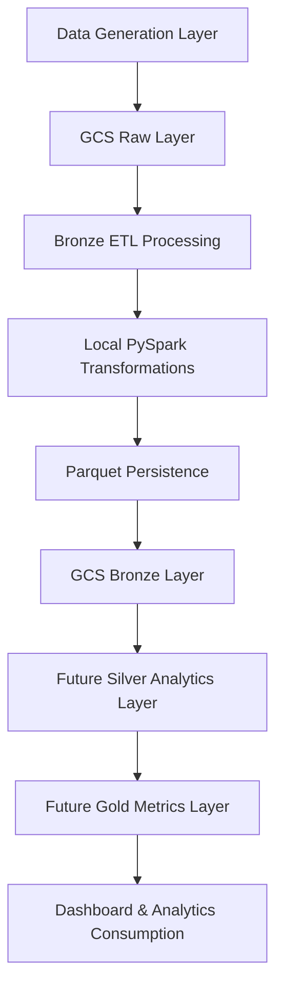

# Wealth Product Analytics Platform (WPA)

A cloud-native data engineering platform designed to simulate behavioral analytics workflows for a digital wealth and trading ecosystem.

The project focuses on building a modular medallion-style data pipeline using distributed processing concepts, cloud storage orchestration, and analytics-ready transformation layers.

---

## Overview

WPA models how user activity and trading interactions can be ingested, transformed, and structured into analytics-ready datasets for downstream reporting and decision-making systems.

The platform currently includes:

* Modular synthetic data generation
* Cloud-based raw data ingestion
* Bronze medallion transformation layer
* Local PySpark processing workflows
* Google Cloud Storage integration
* Parquet-based optimized storage architecture

---

## Architecture

## Architecture



```text
Data Generation
       ↓
GCS Raw Layer
       ↓
Bronze ETL Processing
       ↓
Parquet Persistence
       ↓
Future Silver / Gold Analytics Layers
```

---

## Current Pipeline Scope

### Raw Layer

Stores source datasets in cloud object storage.

Datasets currently modeled:

* Users
* Sessions
* Events
* Trades

---

### Bronze Layer

Initial transformation and standardization layer.

Current processing includes:

* Timestamp normalization
* Event standardization
* Schema inference
* CSV → Parquet conversion
* Cloud persistence orchestration

---

## Tech Stack

| Category               | Technology               |
| ---------------------- | ------------------------ |
| Language               | Python                   |
| Distributed Processing | PySpark                  |
| Cloud Storage          | Google Cloud Storage     |
| Data Format            | Parquet                  |
| Environment            | GitHub Codespaces        |
| Data Modeling          | Modular ETL Architecture |

---

## Repository Structure

```text
config/
src/
  data_generation/
  processing/
  utils/
tests/
```

---

## Engineering Focus Areas

* Modular ETL design
* Medallion architecture principles
* Cloud-native storage workflows
* Distributed processing fundamentals
* Analytics-oriented data modeling
* Production-style project structuring

---

## Roadmap

Planned next phases include:

* Silver behavioral analytics layer
* Gold business metrics layer
* BigQuery integration
* Analytics dashboards
* AI-assisted analytics workflows
* Data quality validation pipelines

---

## Status

Current Phase:

```text
Raw → Bronze
```

Bronze layer orchestration and parquet persistence have been successfully implemented.
